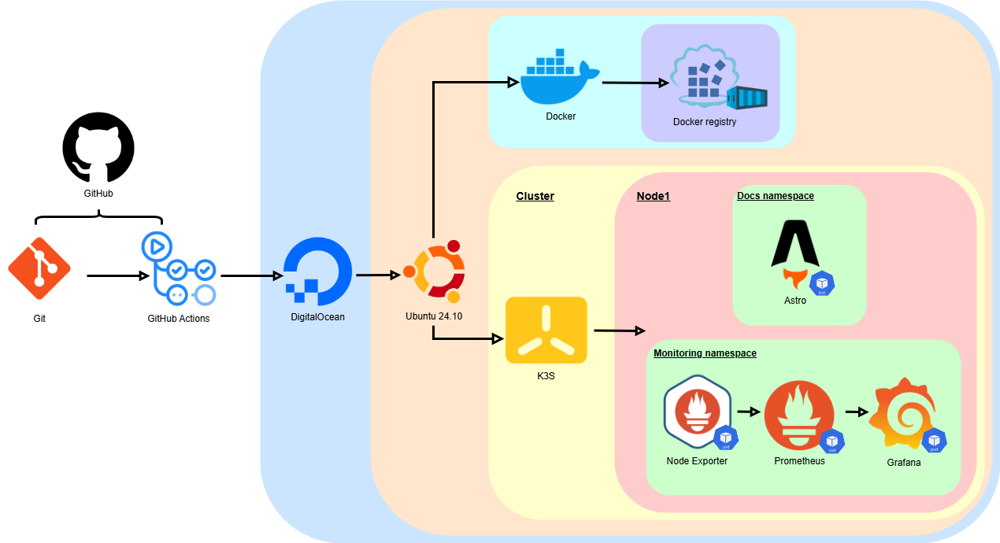
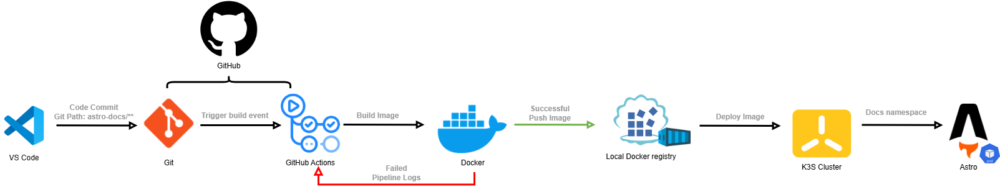

<!-- To view the README during development: CRTL + K > Then type V -->
# DevOps Lab Environment

> **A modern DevOps laboratory showcasing automation, containerization, and infrastructure best practices**

## **Project Overview**

This project demonstrates a **complete, production-ready DevOps infrastructure** built as a learning laboratory and professional showcase. Running on a cost-optimized DigitalOcean droplet (~$30/month), it showcases modern DevOps practices, automation, and monitoring in a real-world environment.

**🔗 [Live Documentation](http://178.62.3.69:30080/)** | **📊 [Monitoring Dashboard](http://178.62.3.69:30854)** | **[⚙️ Browse Code](https://github.com/Zaynity/devops-lab)**

> **🔑 Grafana Public Access:** Username: `public` | Password: `c23Xta5%SZ9L$v$f`

## **Infrastructure Architecture**

### **Architecture Components:**
- **DigitalOcean Droplet** - Ubuntu 24.10 cloud infrastructure
- **K3s Cluster** - Lightweight Kubernetes for single-node deployment
- **Docker Registry** - Private image repository for CI/CD
- **Monitoring Stack** - Prometheus + Grafana + Node Exporter
- **Documentation Site** - Astro Starlight with automated deployment

## **CI/CD Pipeline**

### **Automated Workflow:**
1. **Developer Push** - Code changes to `main` branch
2. **GitHub Actions** - Automated build process
3. **Docker Build** - Astro application containerization
4. **Image Tagging** - Timestamp-based versioning (`20240521-1830`)
5. **Registry Push** - Upload to private Docker registry
6. **K3s Deployment** - Automated image update and deploy

## **Technology Stack**

<table>
<tr>
<td width="50%">

**🏗️ Infrastructure & Orchestration**
- **DigitalOcean** - Cloud hosting platform
- **Ubuntu 24.10** - Operating system
- **K3s** - Lightweight Kubernetes distribution  
- **Docker** - Containerization platform
- **Private Registry** - Local image management

</td>
<td width="50%">

**Monitoring & Observability**
- **Prometheus** - Metrics collection & alerting
- **Grafana** - Visualization & dashboards
- **Node Exporter** - System metrics

</td>
</tr>
<tr>
<td>

**🔄 CI/CD & Automation**
- **GitHub Actions** - CI/CD pipelines
- **Timestamp Tagging** - Version management
- **kubectl** - Kubernetes deployments
- **Infrastructure as Code** - YAML manifests

</td>
<td>

**📚 Documentation & Frontend**
- **Astro** - Modern static site generator
- **Starlight** - Documentation framework
- **Responsive Design** - Mobile-friendly UI
- **Live Updates** - Automated content deployment
- **NGINX** - Web server used in the image

</td>
</tr>
</table>

## **Roadmap & Future Enhancements**

### **Phase 1: Infrastructure as Code**
- [ ] **Terraform Integration** - DigitalOcean resource management
- [ ] **Ansible Playbooks** - Automated server configuration
- [ ] **Multi-environment** support (dev/staging/prod)

### **Phase 2: Advanced Monitoring**
- [ ] **Custom Grafana Dashboards** - Application-specific metrics
- [ ] **Log Aggregation** - ELK/Loki stack integration
- [ ] **Performance Testing** - Automated load testing

### **Phase 3: Security & Compliance**
- [ ] **Security Scanning** - Vulnerability assessments
- [ ] **Compliance Monitoring** - Policy enforcement
- [ ] **Backup & Recovery** - Disaster recovery procedures

---

### **🌟 Explore the Live Environment**

**[📊 View Monitoring](http://178.62.3.69:30854)** | **[📚 Read Documentation](http://178.62.3.69:30080)** | **[⚙️ Browse Code](https://github.com/Zaynity/devops-lab)**

> **🔑 Grafana Public Access:** Username: `public` | Password: `c23Xta5%SZ9L$v$f`

## **Connect & Collaborate**

**Open to DevOps opportunities**

---

**⭐ Star this repository if you find it helpful!**

